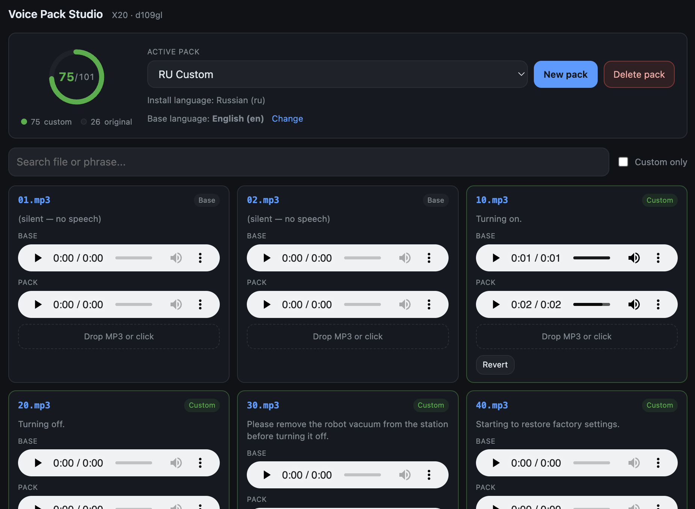
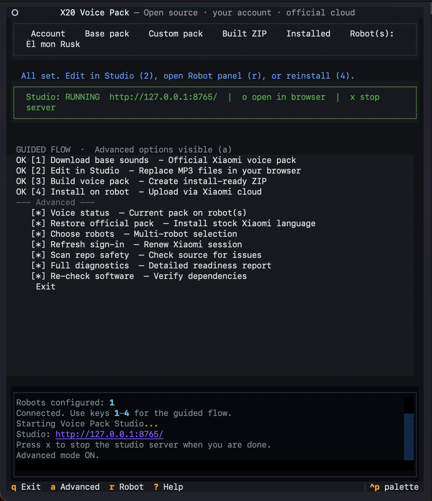

# Vacuum Voice Studio

**Open source · custom robot vacuum voices · remote control · official cloud install**

Personalize what your robot vacuum says — your language, your clips, your style. No ZIP editing by hand, no mystery scripts: everything runs on your computer and installs through the same cloud path as the manufacturer app.

If you searched for *custom robot vacuum voice*, *change vacuum robot sounds*, *robot vacuum voice pack*, *Mi Home custom voice*, or *Xiaomi X20 voice pack*, you are in the right place.

**Supported today:** Xiaomi Robot Vacuum X20 Max — model **`xiaomi.vacuum.d109gl`** (hardware ID `d109gl`). More robots are planned; contributions for other models are welcome.



> **First time?** Read [docs/GETTING_STARTED.md](docs/GETTING_STARTED.md) — plain steps, no jargon.

---

## Trust and transparency

| What we promise | How you can verify |
|---|---|
| Source is readable and local | All logic is in `scripts/` and `web/` — no hidden binaries |
| Your login stays on your PC | `config/config.json` is gitignored |
| Install uses official Xiaomi cloud | See [How install works](#how-install-works-short) |
| No malicious code in the repo | Run the built-in scan (below) |

**Repository virusscan** — checks source files for unexpected outbound URLs, risky code patterns, and accidental secrets:

```bash
./x20-voice-tool.sh --cli virusscan
# or
python3 scripts/repo_virusscan.py
python3 scripts/repo_virusscan.py --clamav   # optional, if ClamAV is installed
python3 scripts/repo_virusscan.py --json
```

Every push to GitHub also runs this scan in [`.github/workflows/virusscan.yml`](.github/workflows/virusscan.yml).

---

## What this does

Your robot stores voice prompts as **101 numbered MP3 files** inside a voice pack (for example `720.mp3` = “robot is stuck”). This tool:

1. Signs in to your **Xiaomi Home** account (same as the phone app)
2. Downloads an official base voice pack from Xiaomi (any supported language: `en`, `ru`, `de`, …)
3. Shows you **which number means which phrase** ([voice file map](docs/VOICE_FILE_MAP.md))
4. Lets you drop in replacement MP3 files
5. Builds a valid pack and **installs it through Xiaomi cloud** — the robot pulls the file from Xiaomi servers, not from a home server

Everything stays under **your Xiaomi Home account**. The tool does not modify firmware or bypass device security — it uses the supported voice-pack upload flow.

---

## What you need

| Need | Notes |
|---|---|
| Computer | Mac, Linux, or Windows with WSL |
| Python 3 | Plus `curl`, `unzip`, `zip` |
| Xiaomi Home app | Robot already added to your account |
| Your own MP3 files | Only use audio you have rights to |

You **do not** need a local HTTPS certificate or a download server on your LAN — the robot downloads packs from Xiaomi cloud (FDS), not from your laptop.

This repo does **not** ship Xiaomi audio, passwords, or pre-made sound packs.

---

## Run it (menu mode)

```bash
chmod +x x20-voice-tool.sh
./x20-voice-tool.sh
```

Run it exactly like that. **Do not** use `source` or `. ./x20-voice-tool.sh`.



When it opens:

- **First visit** → sign-in helper walks you through Xiaomi login (QR code is easiest)
- **Already signed in** → goes straight to the step menu
- **Sign-in expired** → asks you to log in again

### Steps in the menu

| Step | What you do |
|---|---|
| Connect | Sign in to Xiaomi and pick your robot(s) |
| 1 | Download base voice pack (pick language in Studio or CLI) |
| 2 | **Voice Pack Studio** — create a named pack, drag-and-drop MP3 files ([guide](docs/STUDIO.md)) |
| 3 | Build your custom voice pack |
| 4 | Install on your robot(s) |

**More than one vacuum?** Use *Choose which robot(s) to control* and tick each X20 you want.

---

## Which MP3 file is which phrase?

The pack only uses numbers (`130.mp3`, `720.mp3`, …). We publish a full lookup table:

| Resource | Best for |
|---|---|
| [docs/VOICE_FILE_MAP.md](docs/VOICE_FILE_MAP.md) | Humans and AI — searchable table |
| [assets/d109gl_en_transcriptions.csv](assets/d109gl_en_transcriptions.csv) | Scripts and spreadsheets |

Example: **`720.mp3`** → *“The robot vacuum is stuck, please move it to a new location to start.”*

Replace that file with your own `720.mp3` to change the stuck alert only.

---

## Use your own AI (ChatGPT, Claude, Cursor, …)

The tool has a **CLI mode** with JSON output so an AI agent can run checks, build, and install for you.

Start here: **[docs/AI_ASSISTANT.md](docs/AI_ASSISTANT.md)** — copy-paste prompt and command list.

Cursor users: enable the project skill at `.cursor/skills/xiaomi-x20-voice-pack/SKILL.md`.

Quick check:

```bash
./x20-voice-tool.sh --cli readiness --json
```

---

## Command line (short reference)

```bash
./x20-voice-tool.sh --cli --help
./x20-voice-tool.sh --cli devices list --all-regions --vacuums-only --json
./x20-voice-tool.sh --cli languages list --json
./x20-voice-tool.sh --cli download --language ru
./x20-voice-tool.sh --cli studio --background --json
./x20-voice-tool.sh --cli build
./x20-voice-tool.sh --cli install --all-devices --json
./x20-voice-tool.sh --cli robot snapshot --all-devices --json
./x20-voice-tool.sh --cli official --language en
```

Full detail: [docs/CLI.md](docs/CLI.md) · Studio: [docs/STUDIO.md](docs/STUDIO.md)

---

## Pack rules (important)

For `xiaomi.vacuum.d109gl`:

- Exactly **101** MP3 files
- Keep the **same numeric names** (`720.mp3`, not `stuck.mp3`)
- Do not add or delete files
- Build before install

---

## Privacy

| Stays on your PC | Never commit to git |
|---|---|
| `config/config.json` (Xiaomi session) | same |
| `workspace/packs/` (your studio projects) | `output/*.zip` |

See [SECURITY.md](SECURITY.md).

---

## Help and docs

| Doc | Contents |
|---|---|
| [GETTING_STARTED.md](docs/GETTING_STARTED.md) | Step-by-step for beginners |
| [STUDIO.md](docs/STUDIO.md) | Web editor — drag-and-drop voice packs |
| [VOICE_FILE_MAP.md](docs/VOICE_FILE_MAP.md) | All 101 sounds explained |
| [AI_ASSISTANT.md](docs/AI_ASSISTANT.md) | Work with your AI agent |
| [TROUBLESHOOTING.md](docs/TROUBLESHOOTING.md) | Fixes for common issues |
| [CLI.md](docs/CLI.md) | Automation and `--json` |
| [SECURITY.md](SECURITY.md) | Privacy, trust, and virusscan |
| [config/README.md](config/README.md) | Config file fields |

---

## How install works (short)

1. Tool uploads your ZIP to **Xiaomi FDS** storage  
2. Robot downloads it from Xiaomi over HTTPS  
3. Robot confirms install (wait for 100% progress)

Your laptop does not need to stay online after upload finishes.

---

## License

MIT for this project’s code and docs.

MIT does **not** cover Xiaomi audio, trademarks, cloud services, or third-party clips you add yourself.
